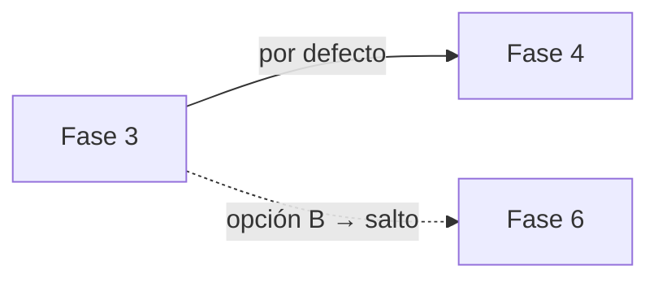

# Crisol — Visión y Arquitectura

> Documento vivo. Hoy existe el esqueleto del proyecto —el motor de estado, el formato de
> escenario y el despliegue— pero todavía no hay una versión usable. Ver [alcance](#10-alcance).

---

## 1. Qué es

Una plataforma **auto-hospedada** para diseñar y conducir **ejercicios por fases con decisiones en grupo**: alguien conduce una sesión en vivo, los participantes entran desde el móvil con un código, reciben información por fases, deliberan y votan qué hacer. Lo votado mueve el ejercicio.

Nace para ejercicios de simulación de crisis (*tabletop exercises* / TTX) y de ahí vienen los ejemplos de este documento. Ese es el primer caso de uso y el que se cubre primero — no el único.

El motor conoce **cuatro primitivas** y ninguna materia:

1. **Fases** que se suceden.
2. **Roles** que ven información distinta.
3. **Decisiones** que toma el grupo.
4. **Consecuencias** que cambian lo que viene después.

Todo lo demás es contenido. Un comité decidiendo bajo presión y una clase de química eligiendo qué reactivo agregar —donde cada opción lleva a un compuesto distinto, con su foto— son el mismo objeto ejecutado con distinto material. El segundo caso ni siquiera necesita reloj.

> Consecuencia de diseño: **nada en el núcleo puede asumir urgencia, riesgo ni adversario.** Un temporizador obligatorio, un vocabulario de "incidente" o una métrica de "daño" en el motor son el mismo bug que hardcodear ciberseguridad. Si una capacidad sólo tiene sentido en una crisis, va en el escenario.

**Cada quien levanta su propia instancia** —una empresa, un colegio, un equipo, una persona. No hay servicio central, no hay cuentas en la nube de nadie, no hay infraestructura que mantener por parte del proyecto.

### Qué NO es

- No es un LMS ni un sistema de cursos.
- No es un motor de simulación con fórmulas ni modelos matemáticos.
- No es una plataforma multi-inquilino: una instancia pertenece a un solo grupo (una empresa, un colegio, un equipo).
- No es un producto SaaS.

---

## 2. Principios de diseño

Cinco reglas que resuelven de antemano la mayoría de las discusiones de implementación:

1. **El motor no sabe de ciberseguridad.** Ciber es el primer paquete de contenido, no el producto. Si algo específico del dominio se filtra al núcleo, es un bug.
2. **El estado vive en el servidor.** Las pantallas —control, proyección, presenter, participante— son espejos. Si a alguien se le muere el navegador, recarga y sigue exactamente donde estaba. Nadie "posee" la sesión desde su pestaña.
3. **El motor de estado es puro.** `(definición del escenario, historial de eventos) → estado actual`. No sabe de websockets ni de salas. De ahí salen la reconexión, la recuperación ante caídas, el reporte final y el futuro modo autoguiado.
4. **El escenario es portable.** El activo real del proyecto no es el código: es que la gente comparta escenarios. Exportar/importar es funcionalidad de primera clase desde el día uno, no un extra.
5. **Levantar la instancia es un comando.** Si correrlo es difícil, nadie lo corre. `docker compose up` y anda.

---

## 3. Conceptos del dominio

| Concepto | Qué es |
|---|---|
| **Escenario** | La plantilla reutilizable. Contiene roles, fases, contenido, gráficos y decisiones. Se diseña una vez, se corre muchas. |
| **Rol** | Un punto de vista dentro del ejercicio: *Comunicación*, *Legales* y *Participante general* en un comité de crisis; *Fiscalía*, *Defensa* y *Jurado* en un juicio simulado en un aula. Define **qué información ve cada uno**. La asimetría de información es el corazón del ejercicio. |
| **Fase** | Un bloque del ejercicio con duración propia. Muestra contenido y, opcionalmente, cierra con una decisión. |
| **Contenido** | Texto, imagen, audio, video o archivo, asociado a una fase y opcionalmente filtrado a un rol. |
| **Gráfico** | Una visualización simple (línea, barras, torta, valor único) cuyos valores cambian según la fase y las decisiones tomadas. |
| **Decisión** | La pregunta con la que cierra una fase, y sus opciones. |
| **Sesión** | Una ejecución en vivo de un escenario: tiene código de sala, participantes, votos y su propia línea de tiempo. |
| **Superficie** | Cada una de las vistas de una sesión: control, presenter, pantalla, participante, reporte. |
| **Evento** | Cada cosa que pasó en una sesión, en orden. Es la fuente de verdad. |

---

## 4. Modelo de datos

### 4.1 Cuentas

```
users
  id, email, password_hash, display_name
  role            owner | author | facilitator
  locale
  totp_secret     (null — reservado para 2FA)
  created_at, last_login_at
```

Una sola organización por instancia. `owner` es quien la instaló; puede crear más usuarios. No hay registro público.

### 4.2 Escenario (autoría)

```
scenarios
  id, slug, title, description
  default_locale, available_locales[]
  status          draft | published
  schema_version
  created_by, created_at, updated_at

scenario_roles
  id, scenario_id, key, name, description
  is_general      (el rol por defecto de quien entra sin código de rol)
  sort_order

phases
  id, scenario_id, sort_order
  title, kind              briefing | inject | dashboard | decision | debrief
  duration_seconds
  next_phase_id            (null = la siguiente por orden; el camino por defecto)
  presenter_cue            (el guion del facilitador para esta fase)
  results_reveal           live | on_presenter_command

phase_contents
  id, phase_id, role_id     (null = visible para todos los roles)
  kind                      text | image | audio | video | file
  body                      (i18n: { es: "...", en: "..." })
  media_id, sort_order

media_assets
  id, scenario_id, filename, mime_type, size_bytes, sha256, storage_key
```

### 4.3 Decisiones y ramificación

```
decisions
  id, phase_id, prompt (i18n)
  tie_breaker              presenter | first_listed
  results_reveal           live | on_presenter_command

decision_options
  id, decision_id, label (i18n), description (i18n), sort_order
  next_phase_id            (null = seguir el camino por defecto de la fase)
```

**Lineal o ramificado lo decide el autor, con un solo modelo.** Si nunca completa `next_phase_id` en las opciones, el escenario es lineal. Si lo completa en alguna, ahí ramifica. No hay dos modos ni migración entre uno y otro, y un escenario puede ser lineal en las fases 1-4 y ramificar en la 5.



### 4.4 Gráficos y efectos

```
charts
  id, scenario_id, key, title (i18n)
  kind              line | bar | pie | stat | gauge
  unit, initial_state   (las series/valores de arranque)

chart_effects
  id, chart_id
  trigger_kind      on_phase_enter | on_option_chosen
  phase_id | option_id
  target            (qué serie / qué punto)
  operation         set | add | subtract | percent_change
  value
```

*"Si en la fase 3 eligen la opción B, la serie `reclamos` sube 20%"* es una fila. *"La porción 2 sube 10 y la 4 baja 10"* son dos filas del mismo efecto.

Deliberadamente **sin fórmulas, sin condiciones encadenadas, sin variables globales**. Si un escenario necesita más que esto, el problema es el escenario.

> Requisito de autoría, no negociable: el autor tiene que **ver el gráfico y previsualizar el efecto mientras lo edita**. Sin eso está programando a ciegas.

### 4.5 Sesión (ejecución)

```
sessions
  id, scenario_id
  join_code                (numérico, corto, legible en voz alta)
  status                   draft | live | paused | ended
  current_phase_id, phase_started_at, remaining_seconds
  answers_open, results_visible
  locale, theme
  created_by, created_at, ended_at

session_role_access
  id, session_id, role_id
  access_code, passphrase_hash     (para roles protegidos: facilitador, observadores)

participants
  id, session_id, display_name, role_id
  rejoin_token             (opaco; vive en el dispositivo)
  first_seen_at, last_seen_at

votes
  id, session_id, decision_id, participant_id, option_id, created_at
  UNIQUE (session_id, decision_id, participant_id)

session_events                      -- append-only, fuente de verdad
  id, session_id, seq, at
  kind        phase_started | phase_ended | answers_opened | answers_closed
              | results_revealed | vote_cast | decision_resolved
              | facilitator_override | participant_joined | session_paused | ...
  actor       (usuario, participante o sistema)
  payload
```

**`session_events` es el corazón.** De ahí salen la reconexión, la recuperación ante caídas, el reporte final y la auditoría de qué pasó exactamente. El estado actual también se materializa en `sessions` por velocidad, pero el log manda.

Los eventos se serializan por sesión y tienen orden total: aunque dos facilitadores toquen los controles a la vez, el resultado es determinista.

---

## 5. Reglas de votación

- **Un voto por participante, todos con el mismo peso.** (En el mundo real no es así; en el ejercicio sí, a propósito.)
- Se puede cambiar el voto mientras las respuestas estén abiertas. Al cerrarse, se congela.
- **Empate → lo define el presentador**, con la opción de configurar "la primera de la lista" como automático.
- **El facilitador puede forzar una opción** aunque no sea la más votada. Cuando lo hace:
  - queda un evento `facilitator_override` con la opción elegida y la que había ganado;
  - se muestra explícitamente en pantalla que **esa decisión no salió de la votación**;
  - aparece marcada como tal en el reporte final.

  No se esconde: para el debrief, "el facilitador intervino acá y por qué" es información valiosa.
- **Revelado de resultados**: en vivo o a discreción del presentador, configurable por el autor a nivel de decisión.

---

## 6. Superficies

| Ruta | Quién | Para qué |
|---|---|---|
| `/admin` | autor | Crear y editar escenarios, gráficos, medios. Importar/exportar. |
| `/sessions` | facilitador | Lanzar sesiones, ver códigos y QR, listar sesiones propias. |
| `/control/:id` | facilitador | Reloj, avanzar/retroceder fase, abrir/cerrar respuestas, revelar resultados, forzar opción. |
| `/presenter/:id` | presentador | Sus cues, próxima fase, tiempo restante, estado de la votación. |
| `/screen/:id` | proyector | Vista de sala: contenido de la fase, gráficos, resultados. Sin controles. |
| `/join` → `/play/:id` | participante | Entrada por código/QR, contenido filtrado por su rol, votación. Móvil primero. |
| `/report/:id` | todos los anteriores | Reporte post-ejercicio, exportable. |

**Reconexión** (importa más de lo que parece): el participante bloquea el teléfono, se le corta el WiFi o cierra la pestaña sin querer — vuelve a entrar con el mismo `rejoin_token` y cae exactamente donde está la sesión, con su voto intacto. Esto es lo que hace fracasar a estas herramientas en una sala real.

**El reloj lo manda el servidor.** Los clientes calculan su desfase e interpolan entre actualizaciones; nunca llevan la cuenta por su lado. Es lo que evita que la pantalla proyectada y los teléfonos muestren tiempos distintos.

---

## 7. Stack

| Capa | Elección | Por qué |
|---|---|---|
| Backend | **Node + TypeScript (Fastify)** | Un solo lenguaje en todo el proyecto baja la barrera para contribuir. |
| Tiempo real | **WebSockets (Socket.IO)** | Reconexión automática y salas ya resueltas. |
| Base de datos | **PostgreSQL** | JSONB para el contenido flexible, relacional para lo demás. |
| Acceso a datos | **Drizzle** (o Prisma) | Migraciones versionadas; el que actualiza su instancia no debe romperse. |
| Frontend | **React + Vite + TypeScript** | SPA servida por el mismo proceso Node. |
| Gráficos | Librería liviana (Recharts o similar) | Los gráficos son simples; no hace falta más. |
| Medios | Disco local en volumen Docker | Con una interfaz de almacenamiento, para que S3 sea opcional después. |
| i18n | i18next (UI) + campos por idioma (contenido) | La UI y el contenido del escenario se traducen por separado. |

**Por qué no Next.js.** Casi todas las pantallas son autenticadas, en vivo e interactivas: el renderizado en servidor no aporta nada acá, y complica el auto-hospedaje y los websockets. Una SPA servida por el propio backend es una imagen Docker más simple de correr y de entender.

**Escala.** Una sesión en vivo soporta cientos de participantes; una instancia, muchas sesiones en paralelo. Se lanza **mono-nodo**, que alcanza de sobra. Para varios nodos hace falta un backplane de pub/sub (Redis) — la interfaz queda preparada, pero **no** entra en el compose por defecto: nadie debería instalar Redis para correr un tabletop de 20 personas.

---

## 8. Despliegue

```yaml
services:
  app:      # imagen única: API + websockets + SPA
  db:       # postgres
volumes:
  media, db-data
```

Dos servicios. Configuración por variables de entorno con `.env.example` documentado. Migraciones automáticas al arrancar. Límites de tamaño de medios (por archivo y por escenario) configurables, **con valores por defecto sensatos** — un autor subiendo videos llena un volumen rápido y el que sufre es el que hospeda.

---

## 9. Formato de escenario portable

Un archivo `.zip`:

```
manifest.json      versión de esquema, checksums, metadata
scenario.json      roles, fases, contenido, decisiones, gráficos, efectos
media/             los archivos referenciados
```

Al importar: se valida el esquema, se remapean los IDs, se verifican los checksums y se avisa si la versión de esquema es más nueva que la instancia. Sin dependencias de red — un escenario descargado se importa en una instancia sin internet.

---

## 10. Alcance

### v1 — lo que hace falta para correr un ejercicio real de punta a punta

- Login y gestión de usuarios de la instancia
- Editor de escenarios: roles, fases, contenido multimedia, decisiones, ramificación opcional
- Editor de gráficos con previsualización de efectos
- Exportar / importar escenarios
- Lanzar sesión, código de sala + QR, códigos de rol protegidos
- Las cinco superficies en vivo, con reloj y reconexión
- Votación con revelado configurable, desempate y override del facilitador
- Reporte post-ejercicio exportable
- Español e inglés
- `docker compose up`
- **Escenarios de ejemplo incluidos**, listos para correr sin escribir nada: uno de ciberseguridad completo y al menos uno de otro rubro, para que se vea desde el primer arranque que el motor no es de una sola materia

### Después

- **Modo autoguiado** (participante solo, a su ritmo) — la razón por la que el motor se escribe puro y separado desde ahora. Trae consigo cuentas de participante y 2FA.
- Biblioteca comunitaria de escenarios
- Métricas entre sesiones
- Almacenamiento S3 opcional, despliegue multi-nodo

### Explícitamente fuera

Chat en vivo entre participantes (la conversación pasa en la sala), video-conferencia integrada, evaluación automática de desempeño, IA generando escenarios.

Cada cosa que entra hay que mantenerla para siempre. Si creés que algo de esta lista debería cambiar, abrí un issue antes de escribir código.
